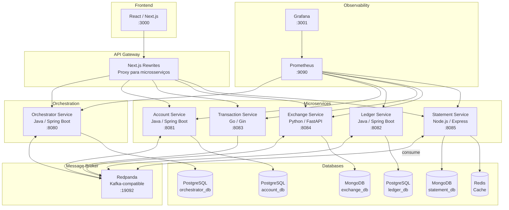
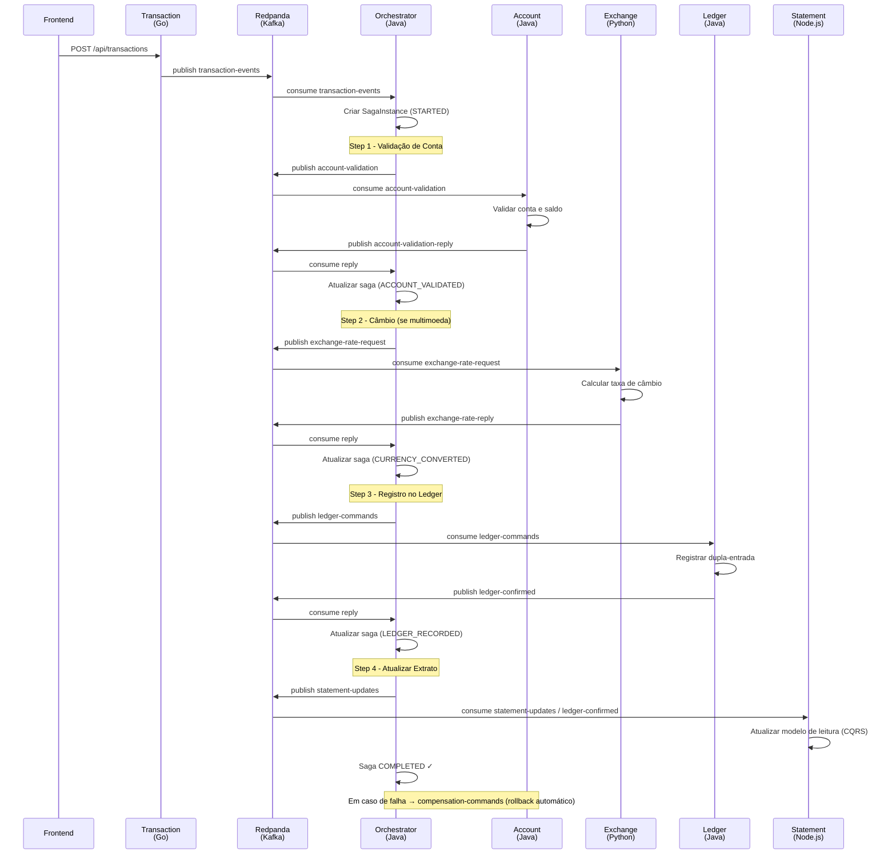
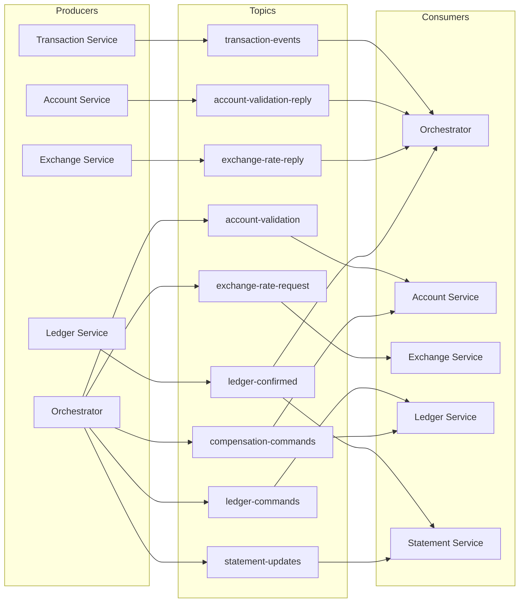
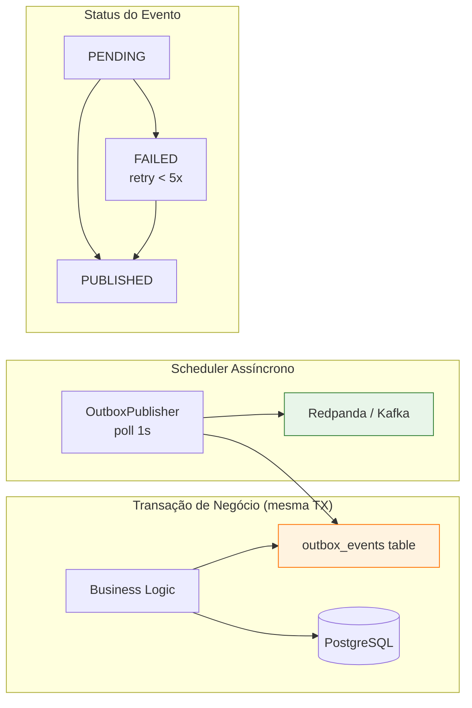
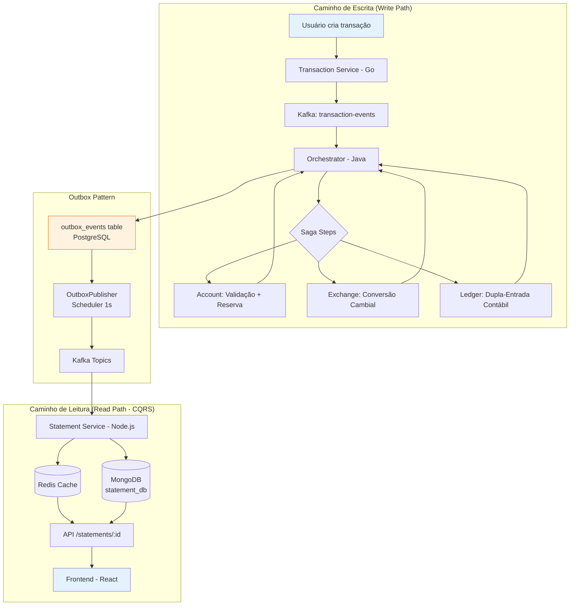

# BankStatement — Extrato Bancário Multiconta e Multimoeda

Arquitetura de Microsserviços poliglota para um Sistema Bancário de Extrato Multiconta e Multimoeda, implementando o **Padrão Saga Orquestrado** com **Redpanda** (Kafka-compatible), **Transactional Outbox** e observabilidade com **Prometheus + Grafana**.

> Implementação prática da arquitetura proposta no TCC: *"Arquitetura de Microsserviços para um Sistema Bancário de Extrato Multiconta e Multimoeda"* — ARAUJO, Julli Mayanne.

---

## Arquitetura Geral



## Fluxo da Saga Orquestrada



## Tópicos Kafka (Redpanda)



## Padrão Outbox (Transactional Outbox)



## Fluxo de Dados End-to-End



## Microsserviços

| Serviço | Stack | Porta | Banco | Responsabilidade |
|---------|-------|-------|-------|------------------|
| **orchestrator-service** | Java 17 / Spring Boot 3.2 | 8080 | PostgreSQL (ACID) | Saga Orchestrator — coordena fluxo transacional |
| **account-service** | Java 17 / Spring Boot 3.2 | 8081 | PostgreSQL (ACID) | Gestão de contas multimoeda, validação de saldo |
| **ledger-service** | Java 17 / Spring Boot 3.2 | 8082 | PostgreSQL (ACID) | Contabilidade dupla-entrada, event store imutável |
| **transaction-service** | Go 1.21 / Gin | 8083 | Stateless | Ingestão de transações, publica eventos no Kafka |
| **exchange-service** | Python 3.11 / FastAPI | 8084 | MongoDB (NoSQL) | Taxas de câmbio, conversão multimoeda |
| **statement-service** | Node.js 20 / Express | 8085 | MongoDB + Redis | Modelo de leitura CQRS, extrato com cache |
| **frontend** | React / Next.js 14 | 3000 | — | UI mobile-first estilo banco digital |

### Database per Service — ACID vs NoSQL

| Banco | Serviços | Justificativa |
|-------|----------|---------------|
| **PostgreSQL (ACID)** | orchestrator, account, ledger | Dinheiro, saldos, contabilidade — consistência forte obrigatória |
| **MongoDB (NoSQL)** | exchange, statement | Modelos de leitura/referência — alta performance de consulta |
| **Redis** | statement (cache) | Cache de extratos frequentes — TTL 60s |
| **Stateless** | transaction | Apenas valida e publica no Kafka |

---

## Como Executar

### Pré-requisitos
- Docker e Docker Compose

### Subir tudo com um comando

```bash
docker-compose up --build
```

### Acessar Serviços

| Serviço | URL | Descrição |
|---------|-----|-----------|
| **Frontend (App)** | http://localhost:3000 | App bancário mobile-first |
| **Grafana** | http://localhost:3001 | Dashboards de observabilidade (admin/admin) |
| **Prometheus** | http://localhost:9090 | Métricas brutas |
| **Redpanda Console** | http://localhost:8888 | Visualizar tópicos Kafka |
| Orchestrator API | http://localhost:8080 | Saga orchestrator |
| Account API | http://localhost:8081 | Gestão de contas |
| Ledger API | http://localhost:8082 | Contabilidade |
| Transaction API | http://localhost:8083 | Ingestão de transações |
| Exchange API | http://localhost:8084 | Câmbio |
| Statement API | http://localhost:8085 | Extrato (CQRS read) |

---

## Endpoints REST

### Transaction Service (Go) — `:8083`

| Método | Endpoint | Descrição |
|--------|----------|-----------|
| `POST` | `/api/transactions` | Criar transação (publica evento no Kafka) |
| `GET` | `/api/transactions/health` | Health check |
| `GET` | `/api/transactions/metrics` | Métricas Prometheus |

```json
// POST /api/transactions
{
  "sourceAccountId": "account-joao-001",
  "targetAccountId": "account-maria-002",
  "transactionType": "TRANSFER_OUT",
  "amount": 100.00,
  "currency": "BRL",
  "description": "Pagamento aluguel"
}
```

### Orchestrator Service (Java) — `:8080`

| Método | Endpoint | Descrição |
|--------|----------|-----------|
| `POST` | `/api/saga/transaction` | Iniciar saga de transação |
| `GET` | `/api/saga/status/{sagaId}` | Status da saga (steps, estado atual) |
| `GET` | `/api/saga/all` | Listar todas as sagas |
| `GET` | `/api/outbox/pending` | Eventos outbox pendentes |
| `GET` | `/api/outbox/failed` | Eventos outbox com falha |
| `GET` | `/api/outbox/saga/{sagaId}` | Eventos outbox de uma saga |
| `GET` | `/api/outbox/stats` | Estatísticas do outbox (total, pending, published, failed) |
| `GET` | `/actuator/prometheus` | Métricas Prometheus |
| `GET` | `/actuator/health` | Health check |

```json
// POST /api/saga/transaction
{
  "sourceAccountId": "account-joao-001",
  "targetAccountId": "account-maria-002",
  "transactionType": "TRANSFER_OUT",
  "amount": 100.00,
  "currency": "BRL"
}

// GET /api/saga/status/{sagaId} — Response
{
  "sagaId": "uuid",
  "currentStatus": "COMPLETED",
  "steps": [
    { "stepName": "ACCOUNT_VALIDATION", "service": "account-service", "status": "ACCOUNT_VALIDATED", "timestamp": "..." },
    { "stepName": "LEDGER_RECORD", "service": "ledger-service", "status": "LEDGER_RECORDED", "timestamp": "..." }
  ]
}

// GET /api/outbox/stats — Response
{
  "total": 42,
  "pending": 0,
  "published": 40,
  "failed": 2
}
```

### Account Service (Java) — `:8081`

| Método | Endpoint | Descrição |
|--------|----------|-----------|
| `GET` | `/api/accounts` | Listar todas as contas |
| `GET` | `/api/accounts/{accountId}` | Detalhes de uma conta (com saldos) |
| `GET` | `/actuator/prometheus` | Métricas Prometheus |
| `GET` | `/actuator/health` | Health check |

```json
// GET /api/accounts/{accountId} — Response
{
  "accountId": "account-joao-001",
  "holderName": "João Silva",
  "holderDocument": "123.456.789-00",
  "status": "ACTIVE",
  "balances": [
    { "currency": "BRL", "balance": 10000.00 },
    { "currency": "USD", "balance": 1000.00 },
    { "currency": "EUR", "balance": 500.00 }
  ]
}
```

### Ledger Service (Java) — `:8082`

| Método | Endpoint | Descrição |
|--------|----------|-----------|
| `GET` | `/api/ledger/entries` | Listar entradas do ledger |
| `GET` | `/api/ledger/entries/{accountId}` | Entradas por conta |
| `GET` | `/actuator/prometheus` | Métricas Prometheus |
| `GET` | `/actuator/health` | Health check |

### Exchange Service (Python) — `:8084`

| Método | Endpoint | Descrição |
|--------|----------|-----------|
| `GET` | `/api/exchange/rates` | Todas as taxas de câmbio |
| `GET` | `/api/exchange/rate/{source}/{target}` | Taxa específica (ex: BRL/USD) |
| `GET` | `/api/exchange/convert/{source}/{target}/{amount}` | Converter valor |
| `GET` | `/api/exchange/health` | Health check |
| `GET` | `/metrics` | Métricas Prometheus |

```json
// GET /api/exchange/rate/BRL/USD — Response
{
  "sourceCurrency": "BRL",
  "targetCurrency": "USD",
  "rate": 0.18
}

// GET /api/exchange/convert/BRL/USD/1000 — Response
{
  "sourceCurrency": "BRL",
  "targetCurrency": "USD",
  "sourceAmount": 1000.0,
  "rate": 0.18,
  "convertedAmount": 180.0
}
```

### Statement Service (Node.js) — `:8085`

| Método | Endpoint | Descrição |
|--------|----------|-----------|
| `GET` | `/api/statements/{accountId}` | Extrato completo (com saldos) |
| `GET` | `/api/statements/{accountId}?currency=BRL` | Extrato filtrado por moeda |
| `GET` | `/api/statements/{accountId}?limit=20&offset=0` | Paginação |
| `GET` | `/api/statements/{accountId}/balances` | Saldos por moeda |
| `GET` | `/api/statements/health` | Health check |
| `GET` | `/metrics` | Métricas Prometheus |

```json
// GET /api/statements/account-joao-001 — Response
{
  "accountId": "account-joao-001",
  "entries": [
    {
      "entryId": "uuid-debit",
      "sagaId": "saga-uuid",
      "accountId": "account-joao-001",
      "direction": "DEBIT",
      "amount": 100.00,
      "currency": "BRL",
      "description": "Débito - Saga xxx",
      "timestamp": "2026-05-06T18:00:00Z"
    }
  ],
  "currentBalances": [
    { "currency": "BRL", "balance": 9900.00 },
    { "currency": "USD", "balance": 1000.00 }
  ],
  "totalCredits": 500.00,
  "totalDebits": 600.00,
  "totalEntries": 12
}
```

---

## Observabilidade (Grafana + Prometheus)

Após `docker-compose up`, acesse:

- **Grafana**: http://localhost:3001 (login: `admin` / `admin`)
- **Prometheus**: http://localhost:9090

### Dashboard pré-configurado

O dashboard **"Bank Statement Microservices - Overview"** é provisionado automaticamente e inclui:

| Painel | Descrição |
|--------|-----------|
| Service Health | Status UP/DOWN de cada serviço |
| HTTP Request Rate | Requisições/segundo por serviço |
| HTTP Latency p95 | Percentil 95 de latência |
| Saga Status | Total de sagas por status |
| Outbox Events | Eventos outbox (pending, published, failed) |
| Kafka Consumer Lag | Lag dos consumers |
| JVM Memory | Uso de heap dos serviços Java |
| DB Connections | Conexões HikariCP (active/idle) |
| Transactions Published | Counter do Go service |
| Exchange Conversions | Counter do Python service |
| Statement Entries | Counter do Node.js service |

### Métricas por serviço

| Serviço | Endpoint | Tecnologia |
|---------|----------|------------|
| Java (3 serviços) | `/actuator/prometheus` | Spring Boot Actuator + Micrometer |
| Go | `/api/transactions/metrics` | Prometheus text format manual |
| Python | `/metrics` | prometheus-client |
| Node.js | `/metrics` | prom-client |

---

## Chaos Testing

Suite de testes de caos para validar resiliência da arquitetura:

```bash
cd chaos-test
pip install -r requirements.txt

# Executar todos os testes
python chaos_test.py all

# Testes individuais
python chaos_test.py flood --transactions 500 --workers 20
python chaos_test.py concurrent_transfers --workers 30
python chaos_test.py multi_currency_storm
python chaos_test.py service_kill --target ledger-service
python chaos_test.py reconciliation
```

| Teste | Descrição |
|-------|-----------|
| **flood** | Envio massivo de transações simultâneas (throughput + latência) |
| **concurrent_transfers** | Transferências simultâneas entre mesmas contas (consistência) |
| **multi_currency_storm** | Câmbios cruzados concorrentes BRL→USD→EUR→GBP |
| **service_kill** | Derruba um container durante processamento (compensação) |
| **reconciliation** | Verifica consistência de saldos entre account, ledger e statement |

> Acompanhe os testes em tempo real no **Grafana** (http://localhost:3001)

---

## Padrões Arquiteturais

| Padrão | Descrição |
|--------|-----------|
| **Saga Orquestrado** | Orquestrador central coordena transações distribuídas com compensação |
| **Transactional Outbox** | Eventos persistidos no banco antes do Kafka — resiliência a falhas do broker |
| **CQRS** | Separação entre caminho de escrita (ledger) e leitura (statement) |
| **Event Sourcing** | Ledger como repositório imutável de eventos (append-only) |
| **Database per Service** | Cada serviço com seu banco, ACID onde necessário |
| **Double-Entry Bookkeeping** | Toda transação gera débito e crédito correspondentes |
| **Idempotência** | Proteção contra processamento duplicado via idempotencyKey |

---

## Estrutura do Projeto

```
bank-statement-microservices/
├── orchestrator-service/     # Java — Saga Orchestrator
├── account-service/          # Java — Gestão de contas
├── ledger-service/           # Java — Contabilidade dupla-entrada
├── transaction-service/      # Go — Ingestão de transações
├── exchange-service/         # Python — Câmbio multimoeda
├── statement-service/        # Node.js — Extrato (CQRS read model)
├── common/                   # Java — Módulo compartilhado (DTOs, Outbox)
├── frontend/                 # React / Next.js — UI banco digital
├── infra/
│   ├── init-databases.sql    # Criação dos bancos PostgreSQL
│   ├── prometheus/           # Configuração do Prometheus
│   └── grafana/              # Provisioning + dashboards Grafana
├── chaos-test/               # Suite de testes de caos (Python)
├── article/                  # Artigo SBBD 2026 (LaTeX SBC)
├── api-collection.http       # Collection HTTP para testar endpoints
└── docker-compose.yml        # Infraestrutura completa (1 comando)
```

---

## Referências

- ARAUJO, Julli Mayanne. *Arquitetura de Microsserviços para um Sistema Bancário de Extrato Multiconta e Multimoeda*. TCC, 2026.
- KLEPPMANN, Martin. *Designing Data-Intensive Applications*. O'Reilly, 2017.
- NEWMAN, Sam. *Building Microservices*. O'Reilly, 2015.
- TANENBAUM, A. S.; VAN STEEN, M. *Sistemas Distribuídos*. Pearson, 2017.

## Licença

MIT License
